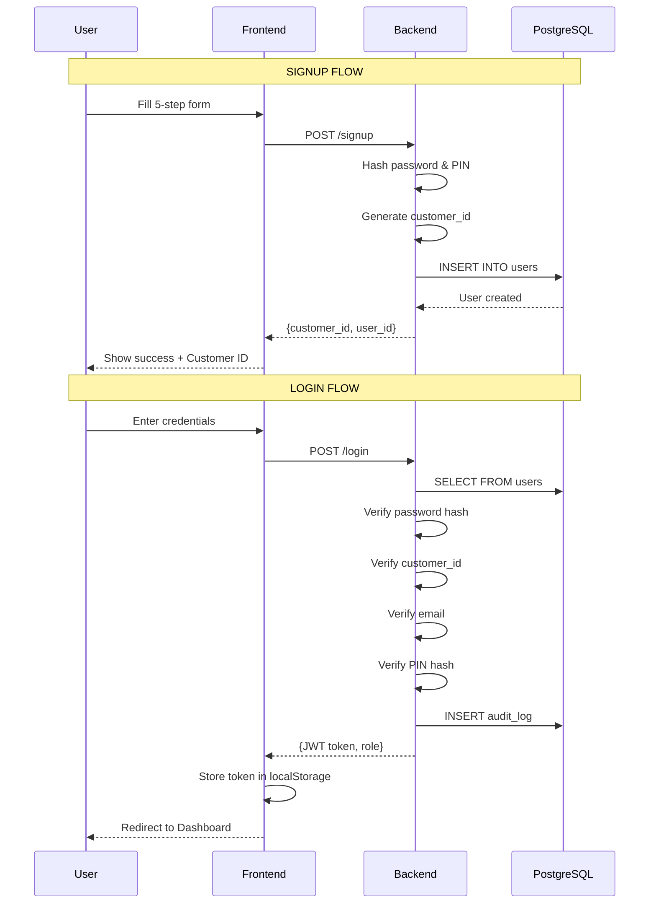

# Full Banking Backend - Implementation Walkthrough

## Summary

Production-grade banking backend with **real PostgreSQL persistence** for all operations.

---

## Signup → Database → Login Flow



---

## Database Tables (7 Total)

| Table | Purpose |
|-------|---------|
| `users` | All credentials + profile from Signup |
| `loan_applications` | ML input features (JSONB) |
| `loan_predictions` | Immutable ML outputs |
| `officer_reviews` | Human decisions with justification |
| `kyc_documents` | Document uploads & verification |
| `repayments` | EMI schedule & payment tracking |
| `audit_logs` | Activity trail for RBI compliance |

---

## What Gets Stored on Signup

| Category | Fields |
|----------|--------|
| **Credentials** | mobile_number, email, password_hash, pin_hash |
| **Personal** | title, first_name, middle_name, last_name, date_of_birth, gender |
| **Address** | address_line1, address_line2, city, state, pincode |
| **KYC** | pan_number, aadhaar_last4 |
| **Consents** | terms_consent, privacy_consent, data_consent, final_consent |
| **Extras** | signature_data (Base64), customer_id (auto-generated) |

---

## Login Verification

All fields verified against database:

| Field | Verification |
|-------|--------------|
| Mobile Number | Exact match required |
| Customer ID | Exact match required |
| Email | Case-insensitive match |
| Password | Bcrypt hash verification |
| PIN | Bcrypt hash verification |
| CAPTCHA | Client-side validation |

---

## API Endpoints (20+)

### Authentication
| Endpoint | Method | Purpose |
|----------|--------|---------|
| `/signup` | POST | Create new user |
| `/login` | POST | Authenticate & get JWT |
| `/user/me` | GET | Get current user profile |

### Credit Score & Eligibility
| Endpoint | Method | Purpose |
|----------|--------|---------|
| `/credit-score` | GET | ML-based score display |
| `/eligibility` | GET | Pre-approved amount |

### Repayments & EMI
| Endpoint | Method | Purpose |
|----------|--------|---------|
| `/repayments/{app_id}` | GET | Full EMI schedule |
| `/repayments/pay` | POST | Make payment |
| `/repayments/upcoming` | GET | Due EMIs |

### Documents
| Endpoint | Method | Purpose |
|----------|--------|---------|
| `/documents/upload` | POST | Upload KYC doc |
| `/documents/{app_id}` | GET | List documents |
| `/documents/{id}/verify` | POST | Officer verify |

### Activity & Profile
| Endpoint | Method | Purpose |
|----------|--------|---------|
| `/activity` | GET | User's audit trail |
| `/user/password` | PUT | Change password |
| `/user/profile` | PUT | Update profile |

---

## Key Files

| File | Purpose |
|------|---------|
| `src/pages/Signup.tsx` | 5-step registration form |
| `src/pages/Login.tsx` | Full credential verification |
| `src/services/api.ts` | JWT token management & API calls |
| `backend/main.py` | All API endpoints |
| `backend/models.py` | 7 SQLAlchemy database models |
| `backend/schemas.py` | Pydantic validation schemas |
| `backend/auth.py` | JWT & password hashing |

---

## How to Test

1. **Start servers** (already running):
   - Frontend: `npm run dev` → http://localhost:5173
   - Backend: `uvicorn backend.main:app --reload` → http://localhost:8000

2. **Test Signup**:
   - Go to http://localhost:5173/signup
   - Complete all 5 steps
   - Note your Customer ID

3. **Test Login**:
   - Go to http://localhost:5173/login
   - Enter same credentials
   - Should redirect to Dashboard

4. **Verify Database**:
   ```bash
   python check_db.py
   ```

---

## Technologies

- **Frontend**: React + TypeScript + Vite
- **Backend**: FastAPI + SQLAlchemy (async)
- **Database**: PostgreSQL
- **Auth**: JWT + bcrypt
- **ML**: XGBoost + SHAP explanations

---

## Security Features

- ✅ Passwords hashed with bcrypt
- ✅ JWT tokens for API auth
- ✅ Role-based access control (customer/bank_officer)
- ✅ All actions logged to audit_logs
- ✅ CAPTCHA on signup/login forms
